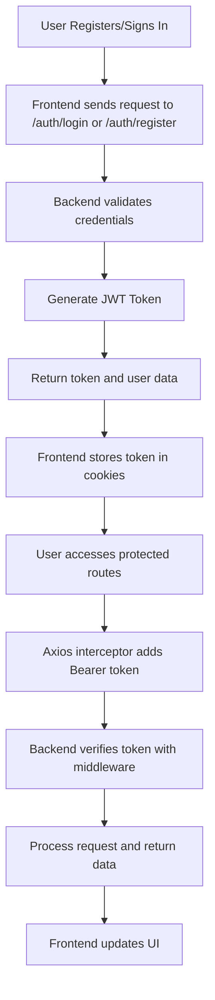
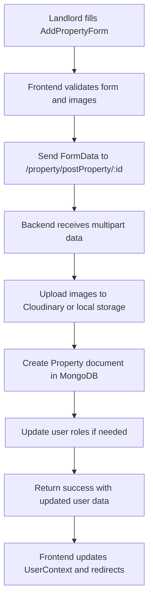

# RentEase Project Documentation

## 1. Project Overview

RentEase is a full-stack real estate listing system built with:
- Backend: Node.js, Express, MongoDB, Mongoose
- Frontend: React, TypeScript, Vite
- Authentication: JWT tokens, cookie-based persistence
- Image upload: Cloudinary when configured, local storage fallback when not
- Email: Nodemailer for password reset and contact/enquiry messages

The system supports:
- User registration and login
- Admin login
- Role-based user management (tenant, landlord)
- Property posting with at least 5 images
- Property browsing, searching, filtering, and reading property details
- Saving and unsaving favorite properties
- Email inquiries to property owners
- Password reset via tokenized email links

## 2. Architecture

### 2.1 Folder structure

`backend/`
- `index.js` — Express app entry point
- `config/dbcon.js` — MongoDB connection implementation
- `routes/` — route definitions for admin, auth, users, and property APIs
- `controller/` — request handlers containing business logic
- `model/` — Mongoose schemas for User, Property, Admin
- `middleware/` — authentication middleware
- `utils/` — helper modules for Cloudinary, local uploads, email, tokens
- `uploads/` — local file storage fallback for uploaded images

`frontend/`
- `src/App.tsx` — router and top-level page layout
- `src/main.tsx` — entry point bootstrapping React
- `src/context/UserContext.tsx` — user state, cookies, role switching
- `src/services/AxiosInstance.tsx` — configured Axios client with auth token injection
- `src/services/Endpoints.tsx` — API endpoint definitions
- `src/pages/` — frontend pages for registration, property browsing, posting, dashboards
- `src/components/` — reusable UI components

## 3. Flow Diagrams

### 3.1 Authentication Flow



### 3.2 Property Posting Flow



## 4. Code Walkthrough with Snippets

### 4.1 Backend Entry Point

From `backend/index.js`:

```javascript
require("dotenv").config();
const express = require("express");
const app = express();
const connectDB = require("./config/dbcon");
const cors = require("cors");
const mainRoutes = require("./routes/index.routes");
const path = require("path");

const corsOption = {
  origin: ["http://localhost:5173", "http://localhost:5174",""],
  methods: "GET, POST, PUT, DELETE, PATCH",
};

app.use(cors(corsOption));
app.use(express.json());
app.use("/uploads", express.static(path.join(__dirname, "uploads")));
app.use("/", mainRoutes);

const PORT = process.env.PORT || 5000;
const startServer = async () => {
  try {
    await connectDB();
    app.listen(PORT, () => {
      console.log(`Server started at http://localhost:${PORT}/`);
    });
  } catch (error) {
    console.error(error);
    process.exit(1);
  }
};

startServer();
```

**Explanation**: This sets up the Express server, enables CORS for frontend origins, serves static files for uploads, and mounts all routes. The server only starts after successful MongoDB connection.

### 4.2 User Authentication

From `backend/controller/login.controller.js`:

```javascript
const logIn = async (req, res) => {
  try {
    const { email, password, rememberMe } = req.body;

    if (!email || !password) {
      return res.status(400).json({
        success: false,
        message: "Email and password are required",
      });
    }

    // 1. Check if Admin
    const admin = await adminModel.findOne({ email });
    if (admin) {
      const isAdminPasswordValid = await bcrypt.compare(password, admin.password);
      if (!isAdminPasswordValid) {
        return res.status(400).json({ success: false, message: "Invalid email or password" });
      }

      const token = generateToken({
        id: admin._id,
        email: admin.email,
        roles: "admin",
      });

      if (rememberMe) {
        res.cookie("token", token, {
          httpOnly: true,
          maxAge: 7 * 24 * 60 * 60 * 1000,
          secure: process.env.NODE_ENV === "production",
        });
      }

      return res.status(200).json({
        success: true,
        message: "Admin logged in successfully",
        token,
        user: {
          id: admin._id,
          fullname: admin.fullname,
          phoneNumber: null,
          profileImage: "",
          email: admin.email,
          roles: "admin",
          currentRole: "admin",
        },
      });
    }

    // 2. Check if Normal User
    const user = await userModel.findOne({ email });
    if (!user) {
      return res.status(400).json({
        success: false,
        message: "Invalid email or password",
      });
    }

    const isUserPasswordValid = await bcrypt.compare(password, user.password);
    if (!isUserPasswordValid) {
      return res.status(400).json({
        success: false,
        message: "Invalid email or password",
      });
    }

    const token = generateToken({
      id: user._id,
      email: user.email,
      role: user.currentRole,
    });

    if (rememberMe) {
      res.cookie("token", token, {
        httpOnly: true,
        maxAge: 7 * 24 * 60 * 60 * 1000,
        secure: process.env.NODE_ENV === "production",
      });
    }

    res.status(200).json({
      success: true,
      message: "User logged in successfully",
      token,
      user: {
        id: user._id,
        fullname: user.fullname,
        phoneNumber: user.phoneNumber,
        profileImage: user.profileImage,
        email: user.email,
        currentRole: user.currentRole,
        roles: user.roles,
      },
    });

  } catch (error) {
    console.error("Login error:", error);
    res.status(500).json({
      success: false,
      message: error.message,
    });
  }
};
```

**Explanation**: This function handles both admin and user login. It first checks for admin accounts, then regular users. Passwords are hashed with bcrypt for security. JWT tokens are generated and optionally stored in cookies for persistence.

### 4.3 Property Creation

From `backend/controller/property.controller.js`:

```javascript
const createProperty = async (req, res) => {
  try {
    const formData = req.body;
    const files = req.files;

    if (!files || files.length < 5) {
      return res.status(400).json({
        message: "Atleast 5 images are required",
      });
    }

    const imgUrls = await uploadImages(files);

    if (!mongoose.Types.ObjectId.isValid(req.params.id)) {
      return res
        .status(400)
        .json({ success: false, message: "Invalid user ID" });
    }

    const newProperty = new propertyModel({
      ...formData,
      imgUrls,
      userId: req.params.id,
    });

    await newProperty.save();

    const user = await userModel.findById(req.params.id);
    if (!user) {
      return res.status(404).json({
        success: false,
        message: "User not found for this property",
      });
    }

    if (!user.roles.includes("landlord")) {
      user.roles.push("landlord");
      user.currentRole = "landlord";
      await user.save();
    }

    res.status(201).json({
      success: true,
      property: newProperty,
      user: {
        roles: user.roles,
        currentRole: user.currentRole,
        fullname: user.fullname,
        email: user.email,
        id: user._id,
        profileImage: user.profileImage,
        phoneNumber: user.phoneNumber,
      },
    });
  } catch (error) {
    console.error(error);
    const isValidationError = error?.name === "ValidationError";
    res.status(isValidationError ? 400 : 500).json({
      success: false,
      message: error.message || "Failed to create property",
      errors: isValidationError ? Object.fromEntries(
        Object.entries(error.errors).map(([key, value]) => [key, value.message])
      ) : undefined,
    });
  }
};
```

**Explanation**: This creates a new property after validating at least 5 images. Images are uploaded, and the property is linked to the user. If the user isn't already a landlord, their role is updated automatically.

### 4.4 Frontend User Context

From `frontend/src/context/UserContext.tsx`:

```typescript
export const UserProvider = ({ children }: { children: React.ReactNode }) => {
  const [user, setUserState] = useState<User | null>(() => {
    const storedUser = Cookies.get("user");
    if (storedUser) {
      const parsedUser: User = JSON.parse(storedUser);

      if (!parsedUser.currentRole && parsedUser.roles.includes("tenant")) {
        parsedUser.currentRole = "tenant";
      }
      return parsedUser;
    }
    return null;
  });

  const setUser = useCallback((userData: User, rememberMe = false) => {
    const defaultRole = userData.roles.includes("tenant")
      ? "tenant"
      : userData.roles[0];
    const updatedUser = {
      ...userData,
      currentRole: userData.currentRole || defaultRole,
    };

    const cookieOptions = {
      expires: rememberMe ? 7 : undefined,
      secure: isSecureContext,
      sameSite: "Lax" as const,
    };

    Cookies.set("user", JSON.stringify(updatedUser), cookieOptions);
    Cookies.set("userId", updatedUser.id, cookieOptions);
    Cookies.set("currentRole", updatedUser.currentRole, cookieOptions);

    setUserState(updatedUser);
  }, []);
  // ... rest of the code
};
```

**Explanation**: This context manages user state across the app. It restores from cookies on load and provides methods to update user data and switch roles.

## 5. Defense Talking Points

### 5.1 Why This Architecture?
- **Separation of Concerns**: Backend handles data and business logic, frontend manages UI and user interactions. This makes the system scalable and maintainable.
- **RESTful APIs**: All communication is through HTTP endpoints, allowing for easy testing and integration.
- **Role-Based Access**: Users can be tenants or landlords, with automatic role assignment on property posting.

### 5.2 Security Measures
- **JWT Authentication**: Tokens are signed and verified, preventing unauthorized access.
- **Password Hashing**: Bcrypt ensures passwords are securely stored.
- **CORS Configuration**: Only allows requests from trusted frontend origins.
- **Input Validation**: Both frontend and backend validate data to prevent injection attacks.

### 5.3 Scalability and Reliability
- **Cloudinary Fallback**: If cloud storage fails, the system falls back to local storage, ensuring reliability.
- **Error Handling**: Comprehensive try-catch blocks and proper HTTP status codes.
- **Modular Code**: Each controller and utility is separate, making it easy to extend features.

### 5.4 Real-World Applicability
- **Image Upload Handling**: Supports multiple images with validation, crucial for real estate listings.
- **Email Integration**: Allows direct communication between tenants and landlords.
- **Search and Filtering**: Enables users to find properties efficiently.

### 5.5 Challenges Faced and Solutions
- **Image Upload Complexity**: Solved by using multer for handling multipart data and providing fallback storage.
- **Role Management**: Implemented dynamic role switching to support multi-role users.
- **State Management**: Used React Context for global state, with cookie persistence for sessions.

## 6. Troubleshooting and Common Issues

- **MongoDB Connection Fails**: Ensure `MONGO_URL` is set correctly in `.env`.
- **Cloudinary Uploads Fail**: Check API keys; the system falls back to local storage.
- **Email Not Sending**: Verify Gmail credentials; in development, logs show what would be sent.
- **CORS Errors**: Confirm frontend is running on allowed origins (localhost:5173).

## 7. Future Enhancements
- Add payment integration for premium listings.
- Implement real-time notifications using WebSockets.
- Add property analytics for landlords.

## 3. Backend Implementation

### 3.1 Startup and configuration

`backend/index.js`:
- Loads environment variables from `.env`
- Creates Express app
- Applies CORS with allowed origins `http://localhost:5173`, `http://localhost:5174`
- Enables JSON parsing middleware
- Serves static files from `/uploads`
- Mounts main router at `/`
- Connects to MongoDB and starts the server on `process.env.PORT || 5000`

`backend/config/dbcon.js`:
- Reads `MONGO_URL` from environment
- Connects with Mongoose
- Logs success or exits with error

### 3.2 Models

#### `backend/model/user.model.js`
Fields:
- `fullname`, `phoneNumber`, `email`, `password`
- `profileImage`
- `isVerified`, `otp`, `otpExpires`
- `resetPasswordToken`, `resetPasswordExpires`
- `savedProperties` — array of `Property` ObjectId references
- `roles` — enum `[tenant, landlord]`, default `tenant`
- `currentRole` — current role in use by the UI, default `tenant`

#### `backend/model/property.model.js`
Fields:
- `title`, `description`
- `category` — enum `Room | Appartment | Commercial Space`
- `propertyType` — enum `Residential | Commercial`
- address fields: `address`, `city`, `municipality`, `wardNo`
- area fields: `totalArea`, `floor`, `dimension`
- `roadType`, `propertyFace`
- room counts and amenities: `bedrooms`, `bathrooms`, `kitchens`, `halls`, `furnishing`, `balcony`, `attachedBathroom`, `suitable`, `floorLoad`, `powerBackup`, `liftAccess`, `pantryArea`, `parkingSpace`
- `imgUrls` required with validator requiring at least 5 URLs
- `price`, `priceInWords`, `negotiable`
- `userId` referencing the posting user
- `status` — `Active | Inactive | Pending | Rented`

#### `backend/model/admin.model.js`
Fields:
- `fullname`, `email`, `password`
- `roles` fixed to `admin`
- static helper `adminExists()` to detect if an admin record exists

### 3.3 Authentication and Authorization

#### `backend/middleware/auth.middleware.js`
- `protect` middleware reads `Authorization: Bearer <token>` header
- Verifies JWT using `JWT_SECRET`
- Loads user from database and attaches `req.user`
- Returns `401` on missing or invalid token

- `checkVerified` middleware ensures `req.user.isVerified` before allowing protected actions such as property posting. This is defined but not currently wired into all property routes.

#### `backend/utils/token.js`
- Creates JWT tokens with `expiresIn: 7d`
- Uses `JWT_SECRET`

### 3.4 Utility modules

#### `backend/utils/cloudinary.js`
- Configures Cloudinary from `CLOUDINARY_CLOUD_NAME`, `CLOUDINARY_API_KEY`, `CLOUDINARY_API_SECRET`
- Exports `isCloudinaryConfigured`

#### `backend/utils/localUploads.js`
- Fallback storage when Cloudinary is not configured
- Saves files to `backend/uploads/<folder>`
- Creates accessible local URLs using the backend base URL

#### `backend/utils/emailSender.js`
- Uses Nodemailer and Gmail auth from `EMAIL_USER`, `EMAIL_APP_PASSWORD`
- If email is not configured, the send action is skipped and logged

### 3.5 Routes and controllers

#### Main router
`backend/routes/index.routes.js` mounts:
- `/admin` → `admin.routes.js`
- `/user` → `user.routes.js`
- `/auth` → `login.routes.js`
- `/property` → `property.routes.js`

#### Auth routes
`backend/routes/login.routes.js`:
- POST `/auth/login` → `logIn`
- POST `/auth/forgot-password` → `forgotPassword`
- POST `/auth/reset-password/:token` → `resetPassword`

`backend/controller/login.controller.js` logic:
- `logIn`
  - checks if email belongs to Admin first, then User
  - compares password with bcrypt
  - generates JWT with role info
  - returns token and user details
  - stores `rememberMe` cookie when requested
- `forgotPassword`
  - generates random reset token
  - stores it on user with 1 hour expiry
  - sends reset link to client or email depending on config
- `resetPassword`
  - verifies token and expiry
  - hashes new password and stores it

#### User routes
`backend/routes/user.routes.js`:
- POST `/user/registerUser` → `createUser`
- GET `/user/getAllUsers` → `getAllUsers`
- GET `/user/getUserById/:id` → `getUserById`
- PUT `/user/updateUser/:id` → `updateUser` (protected)
- DELETE `/user/deleteUser/:id` → `deleteUser` (protected)
- POST `/user/switch-role` → `switchRole` (protected)
- POST `/user/verify-otp` → `verifyOtp`
- POST `/user/save-properties` → `saveProperty` (protected)
- GET `/user/get-saved-properties` → `getSavedProperties` (protected)
- DELETE `/user/unsave-property/:propertyId` → `unsaveProperty` (protected)
- POST `/user/send-enquiry` → `sendEnquiry` (protected)
- POST `/user/contact` → `sendMail`

Important logic in `backend/controller/user.controller.js`:
- `createUser`
  - prevents duplicate email
  - hashes password with bcrypt
  - generates default avatar URL
  - saves user as verified by default
  - returns JWT and user object
- `verifyOtp`
  - checks OTP, expiry, and updates `isVerified`
  - returns a token after verification
- `updateUser`
  - handles both profile updates and optional password change
  - verifies current password if `currentPassword` and `newPassword` are supplied
  - supports uploading new avatar image to Cloudinary/local storage
- `saveProperty` / `unsaveProperty` / `getSavedProperties`
  - let user store favorites in their profile
- `switchRole`
  - toggles between `tenant` and `landlord`
  - adds role to user `roles` array when needed
- `sendEnquiry`
  - sends an email to a property owner via `ownerEmail`
- `sendMail`
  - contact form handler sending a message to the configured support email

#### Property routes
`backend/routes/property.routes.js`:
- POST `/property/postProperty/:id` → `createProperty` with image upload
- GET `/property/getAllProperty` → `getAllProperties`
- GET `/property/propertyById/:id` → `getPropertyById`
- GET `/property/owner/:userId` → `getPropertiesByOwner`
- PUT `/property/updateProperty/:id` → `updateProperty`
- DELETE `/property/deleteProperty/:id` → `deleteProperty`
- PATCH `/property/updateStatus/:id` → `updatePropertyStatus` (protected)

`backend/controller/property.controller.js` logic:
- `uploadImages`
  - converts multer file buffers to base64
  - uploads to Cloudinary when configured
  - otherwise saves locally and returns local URLs
- `createProperty`
  - requires at least 5 image files
  - validates the user ID param
  - creates property and associates it with user
  - updates user role to `landlord` if needed
- `getAllProperties`
  - supports optional query filter for `status`
  - returns latest properties sorted by creation
- `getPropertyById`
  - returns a single property by `_id`
- `getPropertiesByOwner`
  - verifies user existence and returns their posted properties
- `updateProperty`
  - validates `status` value
  - updates the property document safely
- `updatePropertyStatus`
  - ensures the requesting user owns the property
  - only allows valid status values
- `deleteProperty`
  - removes a property by ID

## 4. Frontend Implementation

### 4.1 Application structure

`frontend/src/App.tsx` sets up client-side routing using `react-router`.
- Public pages: `/`, `/browse-properties`, `/contact-us`, `/property/:id`, `/terms-and-conditions`
- Registration pages: `/registration/signup`, `/registration/signin`, `/registration/otp-verification`, `/registration/forgot-password`, `/registration/reset-password/:token`
- Tenant dashboard pages under `/dashboard`
- Landlord pages under `/landlord`
- Shared layout includes `Navbar` and `Footer`
- `ToastContainer` shows user notifications

### 4.2 User authentication state

`frontend/src/context/UserContext.tsx` provides:
- `user` state object
- `setUser()` to store user data in cookies
- `clearUser()` to remove auth cookies and sign out
- `switchRole()` to call backend `/user/switch-role`

Cookies saved by frontend:
- `user` — JSON string of user profile
- `userId` — string ID
- `currentRole` — active role
- `authToken` — JWT token for API calls

On initialization, `UserProvider` restores cookie state if present.

### 4.3 Axios configuration

`frontend/src/services/AxiosInstance.tsx`:
- uses base URL `http://localhost:3000`
- sets `Content-Type` automatically for JSON or multipart form data
- reads `authToken` from cookies and adds `Authorization: Bearer <token>` header
- intercepts `401` responses and clears token when needed

`frontend/src/services/Endpoints.tsx` centralizes API paths for auth, user, and property operations.

### 4.4 Key pages and flows

#### Registration and login

`frontend/src/pages/Registration/Signup.tsx`:
- collects fullname, phone, email, password, confirm password
- validates password strength using `zxcvbn`
- submits to `POST /auth/register` via `API_ENDPOINTS.AUTH.REGISTER`
- navigates to login page on success

`frontend/src/pages/Registration/Signin.tsx`:
- collects email, password, remember me
- calls `POST /auth/login`
- stores returned JWT and user details in cookies/context
- redirects to root or admin dashboard

#### Property browsing

`frontend/src/pages/BrowseProperties.tsx`:
- fetches properties from `GET /property/getAllProperty`
- filters by category, property type, price range, and search query
- allows side-panel filtering on desktop and mobile
- displays each property using `PropertyCard`

#### Property detail view

`frontend/src/pages/PropetyDetails.tsx`:
- loads property by ID from `GET /property/propertyById/:id`
- fetches owner info using `GET /user/getUserById/:userId`
- checks whether current user has saved this property
- supports save/unsave via `/user/save-properties` and `/user/unsave-property/:propertyId`
- sends enquiry emails using `/user/send-enquiry`

#### Add property form

`frontend/src/pages/Landlord/AddPropertyForm.tsx`:
- contains a full property creation form
- requires at least 5 images
- builds `FormData` with property fields and images
- calls `POST /property/postProperty/:id` with authenticated user
- updates `UserContext` after property creation
- redirects to landlord dashboard on success

### 4.5 Role management

- Users can switch roles using the backend `/user/switch-role` endpoint.
- Available role values are `tenant` or `landlord`.
- The frontend stores `currentRole` separately and updates cookies on switch.

### 4.6 Saved properties

- When a user saves a property, the backend adds the property ID to `user.savedProperties`.
- Saved properties are retrieved from `/user/get-saved-properties`.
- Unsave calls `/user/unsave-property/:propertyId`.

## 5. Data and Session Flow

### 5.1 User registration flow
1. Frontend submits signup form to `/auth/register`.
2. Backend checks for duplicate email and hashes password.
3. Backend creates user document and returns user data and JWT.
4. Frontend optionally stores token and user details.

### 5.2 Login flow
1. Frontend submits login credentials to `/auth/login`.
2. Backend checks first for admin account, then regular user.
3. Password is verified with bcrypt.
4. JWT token is generated and returned.
5. Frontend stores `authToken` cookie and `user` cookie.

### 5.3 Property posting flow
1. Landlord fills `AddPropertyForm` and uploads at least 5 images.
2. Frontend sends `multipart/form-data` to `/property/postProperty/:id`.
3. Backend converts uploaded image buffers internally and uploads them.
4. If Cloudinary is configured, images go to Cloudinary; otherwise they save locally under `/uploads`.
5. Property is stored in MongoDB and linked to the posting user.
6. The user record is updated to include `landlord` role if missing.

### 5.4 Saved properties flow
1. User chooses to save a property on the detail page.
2. Frontend calls `/user/save-properties` with `propertyId`.
3. Backend updates the user's `savedProperties` array.
4. Later, `/user/get-saved-properties` returns property documents.

### 5.5 Password reset flow
1. User requests reset from `/auth/forgot-password`.
2. Backend generates a reset token and expiry.
3. Email is sent with a reset link to frontend URL using the token.
4. User submits new password to `/auth/reset-password/:token`.
5. Backend validates token and expiry, hashes new password, and clears token data.

## 6. Important Code Details

### 6.1 File uploads

Both `user.controller.js` and `property.controller.js` use multer memory storage.
- Files are converted into base64 using `datauri/parser`.
- If Cloudinary is enabled, uploads happen to `rentEase/userAvatar` or `rentEase/Properties` folders.
- If not, the app saves files locally and returns a URL like `http://localhost:3000/uploads/<folder>/<filename>`.

### 6.2 Validation logic

- Property image validation is enforced in both frontend and backend.
- Property status updates accept only `Active`, `Inactive`, `Pending`, or `Rented`.
- Category and property type use strict enum values in the Mongoose schema.
- `user.updateUser` supports secure password changes when current password is validated.

### 6.3 Role update logic

- Posting a property automatically adds `landlord` to a user’s roles when a new property is created.
- The user’s `currentRole` is updated to `landlord` when needed.
- `switchRole` can transition a user between `tenant` and `landlord` and persists that choice.

### 6.4 Email fallback behavior

- If email is not configured, `sendMail` logs the send request and returns a skipped result.
- `forgotPassword` returns development reset link information when email is unavailable.

## 7. Environment Variables

Backend `.env` should include:
- `MONGO_URL` — MongoDB connection string
- `JWT_SECRET` — secret used for signing JWTs
- `PORT` — optional server port (default 5000)
- `CLOUDINARY_CLOUD_NAME`, `CLOUDINARY_API_KEY`, `CLOUDINARY_API_SECRET` — optional Cloudinary settings
- `EMAIL_USER`, `EMAIL_APP_PASSWORD` — optional Gmail credentials for sending emails
- `CLIENT_URL` — frontend base URL used in reset links
- `ADMIN_FULLNAME`, `ADMIN_EMAIL`, `ADMIN_PASSWORD` — admin account credentials

## 8. Running the Project

### Backend
1. Open `backend/`
2. Install dependencies: `npm install`
3. Start server: `npm start`
4. Confirm server listens at `http://localhost:5000` (or configured port)

### Frontend
1. Open `frontend/`
2. Install dependencies: `npm install`
3. Start app: `npm run dev`
4. Confirm frontend runs at `http://localhost:5173` by default

## 9. Notes for Pre-Defense

- The backend is decoupled from the frontend: all UI actions call REST APIs.
- Authentication uses JWT tokens and cookies for session persistence.
- Property posting requires image handling and falls back cleanly if cloud storage is unavailable.
- Users have dual roles; a tenant can become a landlord and view landlord-specific pages.
- The system supports core rental marketplace features: listing properties, browsing, saving favorites, owner enquiries, and password recovery.

## 10. Appendix: Main API Endpoints

### Auth endpoints
- `POST /auth/login`
- `POST /auth/forgot-password`
- `POST /auth/reset-password/:token`

### User endpoints
- `POST /user/registerUser`
- `GET /user/getAllUsers`
- `GET /user/getUserById/:id`
- `PUT /user/updateUser/:id`
- `DELETE /user/deleteUser/:id`
- `POST /user/switch-role`
- `POST /user/verify-otp`
- `POST /user/save-properties`
- `GET /user/get-saved-properties`
- `DELETE /user/unsave-property/:propertyId`
- `POST /user/send-enquiry`
- `POST /user/contact`

### Property endpoints
- `POST /property/postProperty/:id`
- `GET /property/getAllProperty`
- `GET /property/propertyById/:id`
- `GET /property/owner/:userId`
- `PUT /property/updateProperty/:id`
- `DELETE /property/deleteProperty/:id`
- `PATCH /property/updateStatus/:id`
